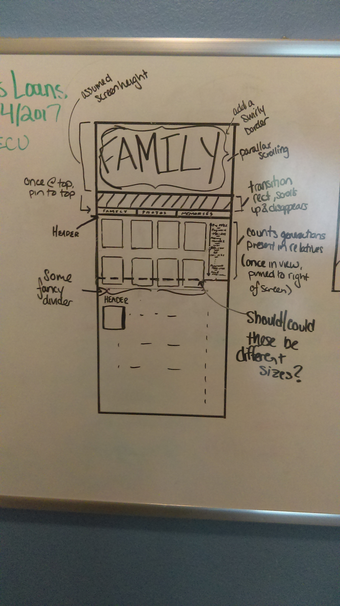
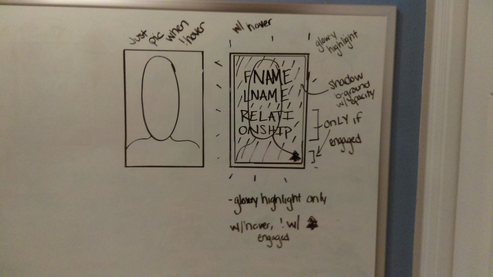
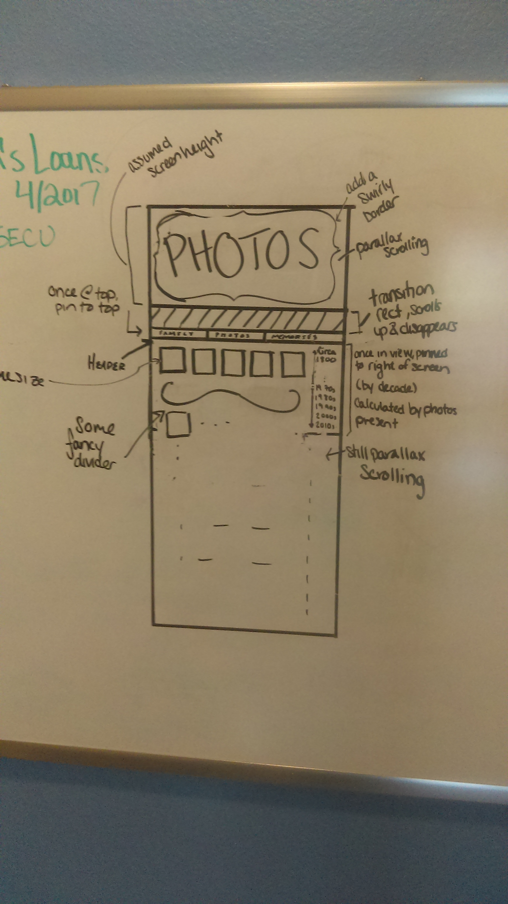
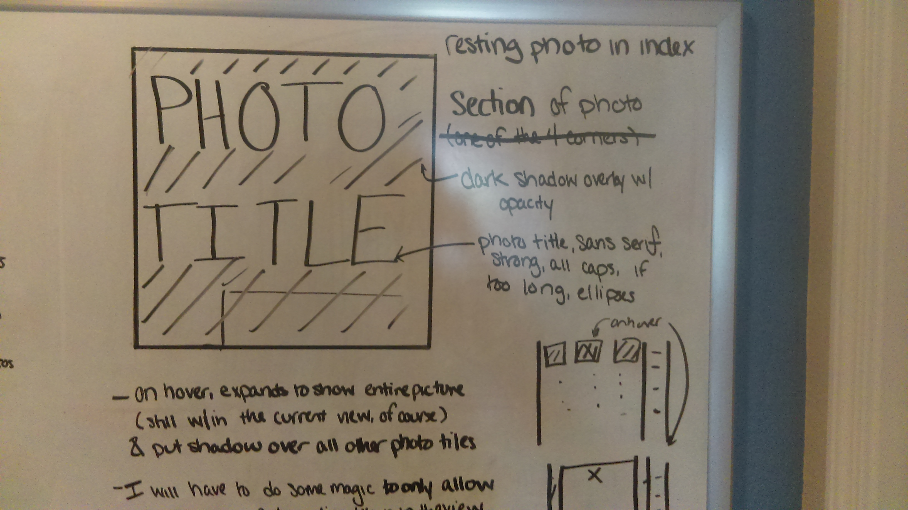
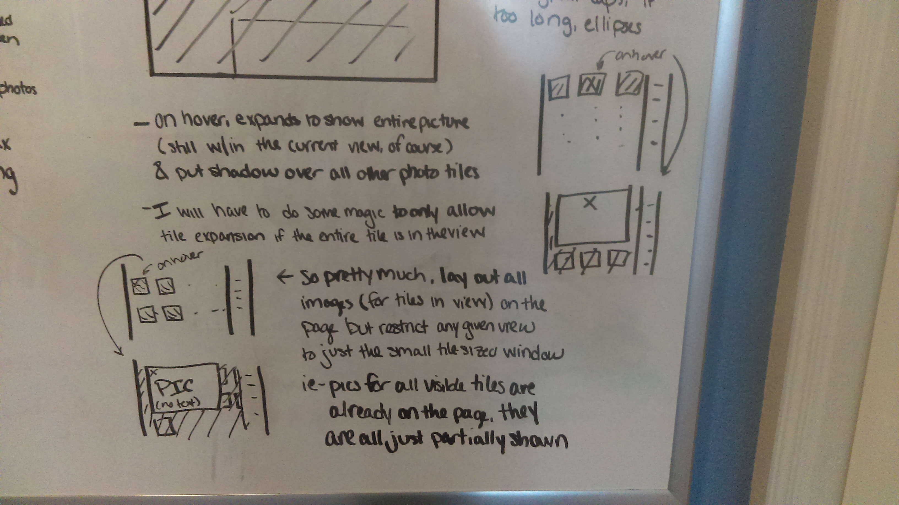
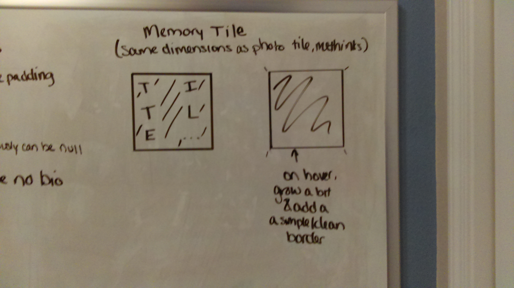

## Family Photo Project

In an effort to save the photos currently stored underneath my grandma's bed, I'm making a Rails application that uploads family photos alongside a family tree.

This is primarily to preserve photos, but I would like to include any other family history. I reckon some people might want to just to upload some stories (textual at first, then maybe audio recordings)

### Framework

All of my database relations.

*NOTE, ALL FOREIGN KEYS ARE HANDLED BY THE MODEL, NOT THE DB

#### Tables

* *Relative*

**Attribute** | **Value** | **Restrictions**
--- | --- | ---
id | integer | auto-generated
first | string |
middle | string | can be nil
maiden | string | can be nil
surname | string |
nickname | string |  can be nil
sex | string |
birthday | date |
deathday | date | can be nil

* *Photo*

**Attribute** | **Value** | **Restrictions**
--- | --- | ---
id | integer | auto-generated
taken_on | date |
uploaded_by | id | reference to Relative
header | string | can be nil
caption | string | can be nil
locationd | string | 

* *Memory*

**Attribute** | **Value** | **Restrictions**
--- | --- | ---
id | integer | auto-generated
author_id | id | reference to Relative
title | text |
content | text |
created_on | date | auto-generated, but use it
location| string |

* *Event*

**Attribute** | **Value** | **Restrictions**
--- | --- | ---
id | integer | auto-generated
author_id | id | reference to Relative
date | date | when this happened
content | text | limit length to short text  anything longer is a memory.
memory_id | id | reference to Memory, especially if content is too short
location | string |

* *User*

**I'm not generating this guy yet because I assume he will need special treatment**

For keeping track of those who use the application.

**Attribute** | **Value** | **Restrictions**
--- | --- | ---
id | integer | auto-generated
username | string | assigned by me
password | string | assigned by me
relative_id | id | assigned by user on first login

#### Joins

* *DescendantBranch*

**Attribute** | **Value** | **Restrictions**
--- | --- | ---
id | integer | auto-generated
parent_id | id | reference to Relative
child_id | id | reference to Relative

* *MarriageBranch*

**Attribute** | **Value** | **Restrictions**
--- | --- | ---
id | integer | auto-generated
wife_id | id | reference to Relative
husband_id | id | reference to Relative
start_date | date |
end_date | date| can be nil

* *PhotoTag*

**Attribute** | **Value** | **Restrictions**
--- | --- | ---
id | integer | auto-generated
photo_id | id | reference to Photo
relative_id | id | reference to Relative

* *EventTag*

**Attribute** | **Value** | **Restrictions**
--- | --- | ---
id | integer | auto-generated
event_id | id | reference to Event
relative_id | id | reference to Relative

### Design

#### *UX*

#### Layout
(I'm obviously not a designer)

I doodled on my whiteboard. These are FAR from 'wire frames,' but they got the ideas out of my head. I can't hope for super pretty things here, but I'd like a functional thought. I need to add a site map soon too.

NOTE FOR LATER- I NEED AN ID FOR USER

Relative Index

Relative Tile

Photo Index

Photo Tile

Photo Tile (Expanded)

Memory Tile

